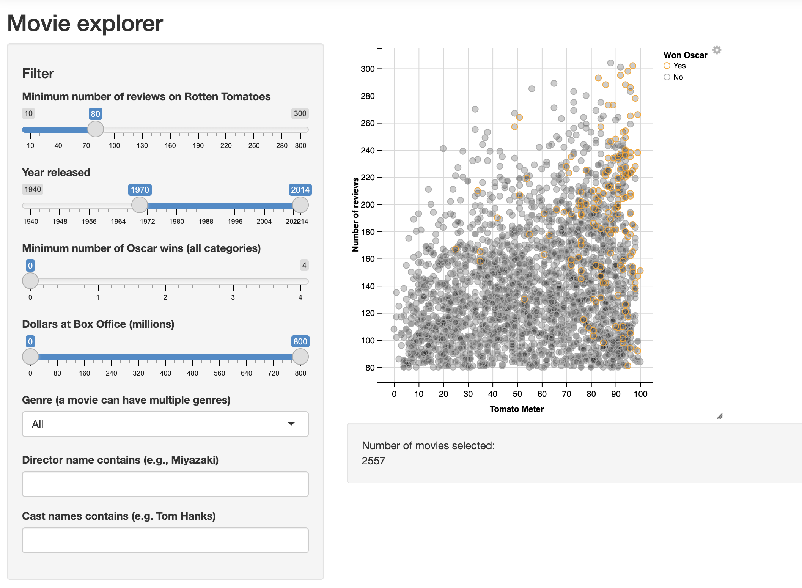

<link rel="stylesheet" href="styles.css" type="text/css">
<link rel="stylesheet" href="site_libs/academicons-1.9.1/css/academicons.min.css"/>

   

## **E-bay Transaction Analysis**

 

🚨**THIS IS A FICTIONAL PROJECT MEANT AS AN EXAMPLE FOR THE STEPBYSTAT COMMUNITY.**

   

### 1. Screenshot of Dashboard

   

### 2. Summary

James’ computer and electronic retail shop hired YLY consultant co. for data analysis. This retail shop currently faced an issue that the price of wholesale has been increasing, but the profits of the retail shop has stayed on the same level of 2021. Therefore, the owner of the retail shop wants to build insights on maximizing profit and minimizing costs based on inventory turnover ratio.
   

### 3. Resources

For more insights, please check presentation slides by clicking [HERE](files/E-bay_Presentation.pdf).
You can find proposal by clicking [HERE](files/E-bay_Proposal.pdf), read me by clicking [HERE](files/E-bay_Preadme.pdf).

