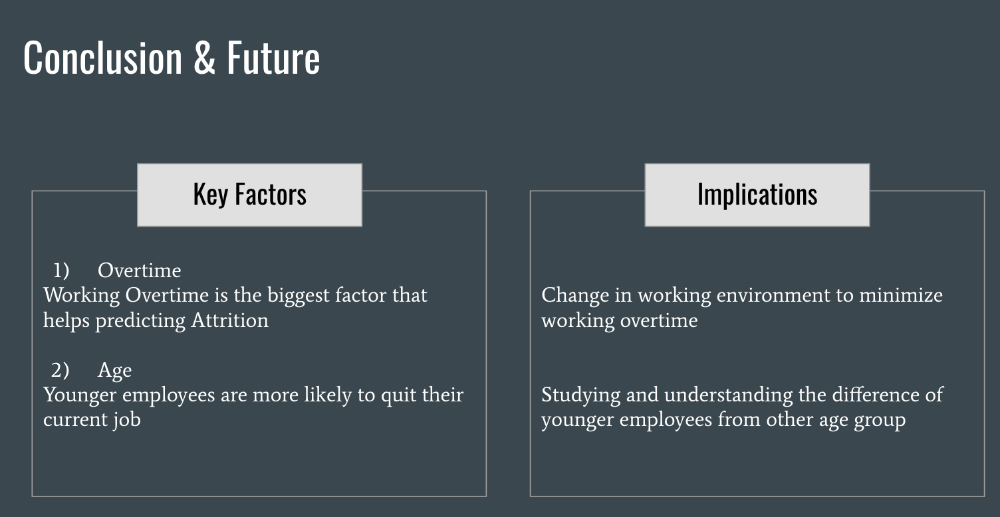

<link rel="stylesheet" href="styles.css" type="text/css">
<link rel="stylesheet" href="site_libs/academicons-1.9.1/css/academicons.min.css"/>

   

## **Employee Attrition and Resignation Prediction for Healthcares** 

  

   

### 1. Figure

 

  

### 2. Goal

How to better understand the demand in the Healthcare job market.

To implement new plans to reduce turnover rates.
 

### 3. Methodology & Summary

+ KNN, Naive Bayes, Decision Tree and Random Forest models were used. 

+ Logistic Regression, KNN,and Decision Trees were found to be suboptimal.

+ Overtime: Working Overtime is the biggest factor that helps predicting Attrition

+ Age: Younger employees are more likely to quit their current job

+ Studying and understanding the difference of younger employees from other age group

 

### 4. Code

Please click
[HERE](files/employeeattritionreport.pdf) for report.

 

### 5. References

Kaggle dataset: https://www.kaggle.com/datasets/jpmiller/employee-attrition-for-healthcare?resource=download
“2023 NSI National Health Care Retention & RN Staffing Report.” NSI_National_Health_Care_Retention_Report.,

https://www.nsinursingsolutions.com/Documents/Library/NSI_National_Health_Care_Retention_Report.pdf. 

Lecture Slides:
Prasad Kislaya, Naive Bayes, Performance Measures ,Tree-Based Models in R, ClassificationFirst Look, K Nearest Neighbor (Revised) 

