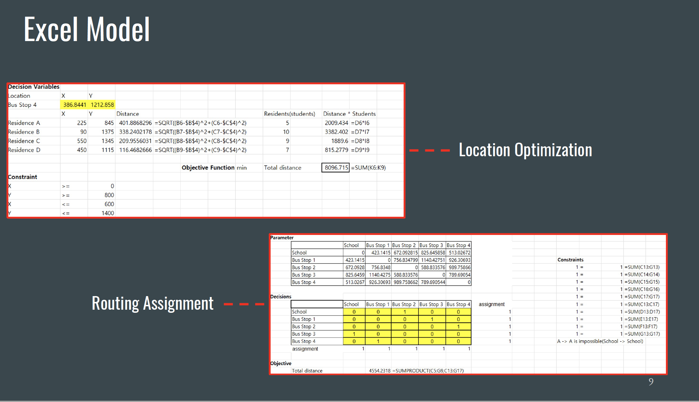

<link rel="stylesheet" href="styles.css" type="text/css">
<link rel="stylesheet" href="site_libs/academicons-1.9.1/css/academicons.min.css"/>

   

## **Bus Routing Optimization **

 

   

### 1. Screenshot of Dashboard

   

### 2. Summary

   

### 3. Presentation

For more insights, please check my Presentation slide by clicking [HERE](files/Bus Routing Optimization Helps Boston Public Schools Design Better Policies.pdf).

