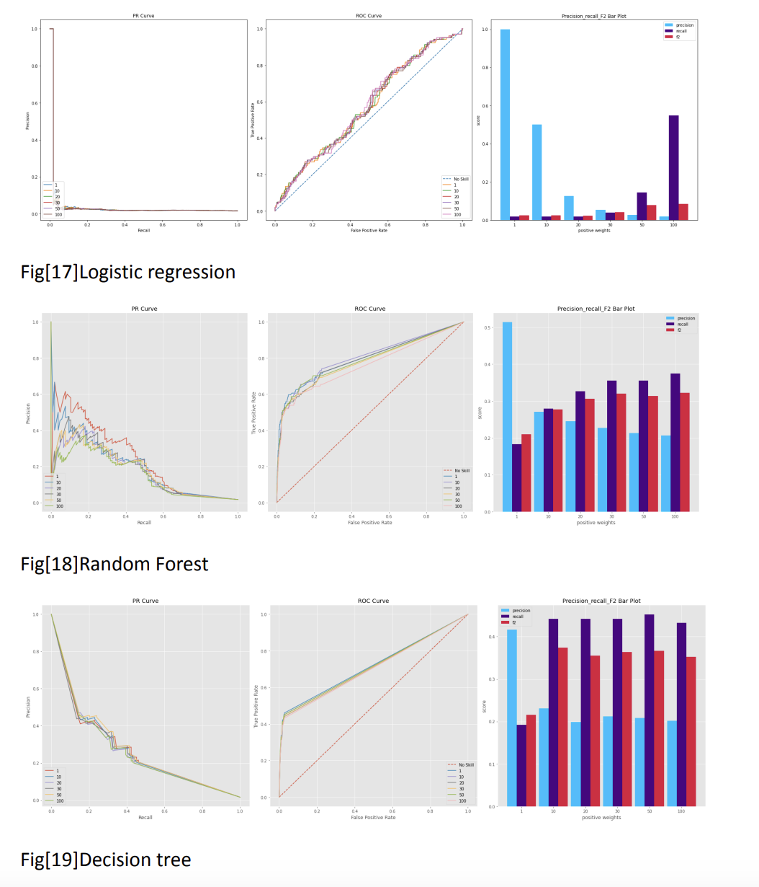

<link rel="stylesheet" href="styles.css" type="text/css">
<link rel="stylesheet" href="site_libs/academicons-1.9.1/css/academicons.min.css"/>

   

## **Predicting Risky Credit Card Applicants** 

  

   

### 1. Figure

[Fig. LASSO regression features by importance]

 

  

### 2. Goal

To predict the risk level of credit scores, we used customer profile
information along with credit records.  

### 3. Methodology & Summary

+ Logistic Regression, Random Forest,and Decision Trees were found to be suboptimal 

+ Deep learning models were utilized to address the limitations of machine learning models. 

+ The basic deep learning model consisted of a 3-layer binary deep neural network with 20 nodes.
    
+ The Relu function was used as the activation function in the hidden layers. 

+ Binary cross-entropy was used as the loss function. 
 

### 4. Code

Please click
[HERE](files/Predicting%20Risky%20Credit%20Card%20Applicants.pdf) for
the analysis report and
[HERE](https://nbviewer.org/github/yullieyang/yullieyang.github.io/blob/main/files/Predicting%20Risky%20Credit%20Card%20Applicants.ipynb)
for the code.

 

### 5. References

https://developers.google.com/machine-learning/data-prep/construct/sampling-splitting/imbalanced-        data?hl=en
    
https://www.analyticsvidhya.com/blog/2021/06/5-techniques-to-handle-imbalanced-data-for-a-classif        ication-problem/
    
https://machinelearningmastery.com/undersampling-algorithms-for-imbalanced-classification/
    
http://glemaitre.github.io/imbalanced-learn/generated/imblearn.under_sampling.OneSidedSelection.html
    
https://machinelearningmastery.com/bagging-and-random-forest-for-imbalanced-classification/
