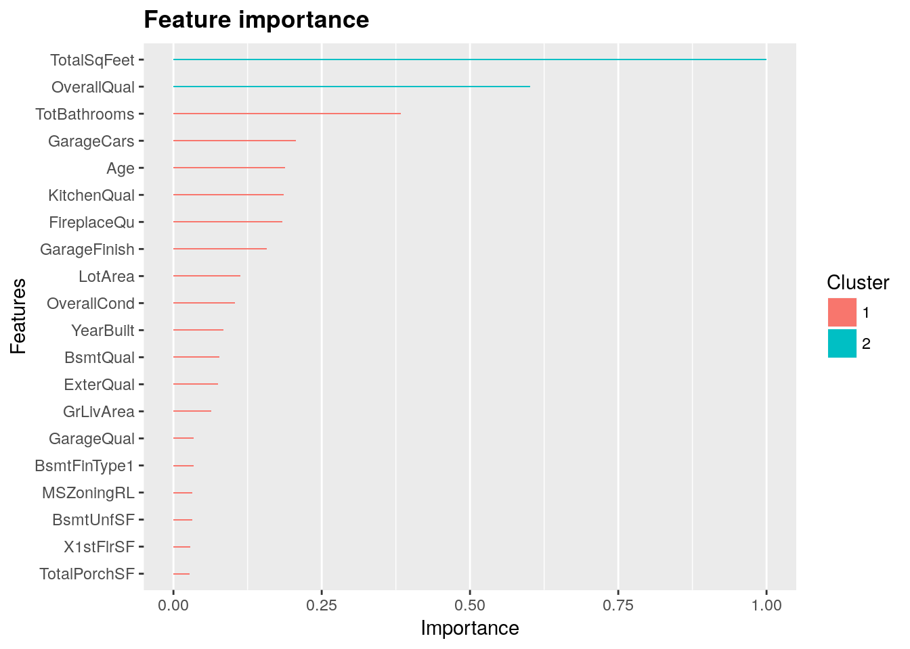

<link rel="stylesheet" href="styles.css" type="text/css">
<link rel="stylesheet" href="site_libs/academicons-1.9.1/css/academicons.min.css"/>

   

## **Predicting Risky Credit Card Applicants **

 

🚨**THIS IS A FICTIONAL PROJECT MEANT AS AN EXAMPLE FOR THE STEPBYSTAT COMMUNITY.**

   

### 1. Figure

[Fig. LASSO regression features by importance]

 

  

### 2. Goal
To predict the final price of each home using 79 explanatory variables describing (almost) every aspect of residential homes in Ames, Iowa.

 

### 3. Methodology & Summary

  + LASSO regressions showed the best performance with a cross validation RMSE-score of 0.1121. Although there is a lot of multicollinearity among the variables, LASSO regression include feature selection; it does not select a substantial number of the available variables in its model, as it is supposed to do.
  + The XGBoost model also performs very well with a cross validation RMSE of 0.1162.
  + As those two algorithms are very different, averaging predictions is likely to improve the predictions. As the Lasso cross validated RMSE is better than XGBoost's CV score, I decided to weight the Lasso results double.

 

### 4. Code

Please click [HERE](https://www.kaggle.com/erikbruin/house-prices-lasso-xgboost-and-a-detailed-eda/report) for the analysis report and code.

 

