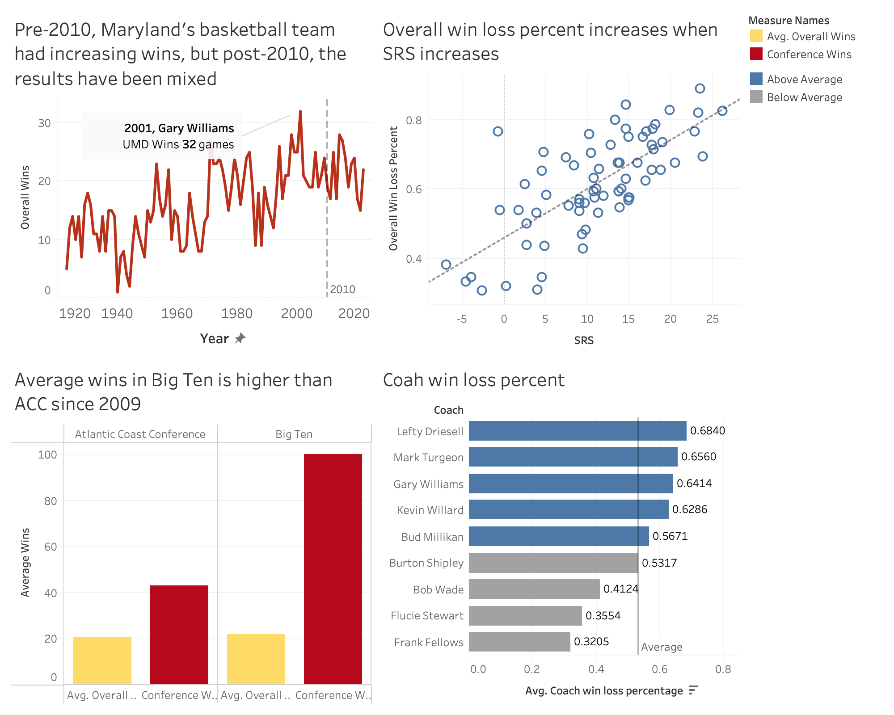

<link rel="stylesheet" href="styles.css" type="text/css"> <link rel="stylesheet" href="site_libs/academicons-1.9.1/css/academicons.min.css"/>

   

## **University of Maryland Basketball Game Analysis**

 

   

### 1. Screenshot of Dashboard

   

### 2. Summary

-   Pre-2010, Maryland's basketball team had increasing wins, but post-2010, the results have been mixed
-   Overall win loss percent increases when SRS increases
-   Average wins in Big Ten is higher than ACC since 2009

   

### 3. Tableau Visualization

For more insights, please check my Tableau Visualization by clicking [HERE](files/umd_basketball_visualization.pdf).

   

### 4. Data Source

<https://www.sports-reference.com/cbb/schools/maryland>
